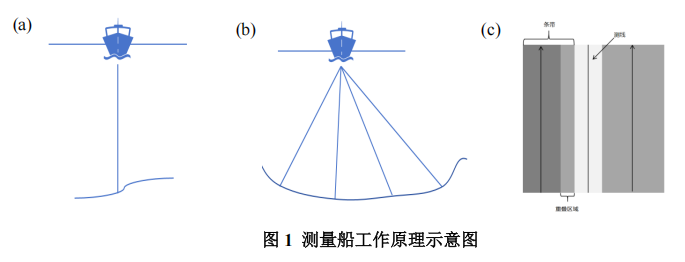

# 基于几何模型与递推模型的多波束测线布设问题

## 摘要

多波束测线是海域测量中的重要技术，测量海域地貌关键是实现对待测海域
进行测线布设。本文利用几何模型与递推模型建立覆盖宽度、重叠率等海域测量
值的函数关系，旨在构建多波束测线布设模型，从而解决测线布设问题。

针对问题一，本文建立了海水深度、覆盖宽度和重叠率关于测量船位置的几
何模型：首先通过正弦定理和三角函数构建覆盖宽度关于海水深度的函数关系，
再根据三角形相似的性质构建海水深度关于测线位置的函数关系，最后根据覆盖
宽度和海水深度的函数关系将题设中的重叠率从平面推广到坡面。将相关数据带
入模型求解并分析可知，在相邻测线间距一定时，覆盖宽度和重叠率随海水深度
的增加而增加。

针对问题二，本文建立了三维海域覆盖宽度模型：首先以坡面法线在水平面
上的投影为𝑥轴，根据右手法则建立三维海域坐标系，其次本文定义了海水深度
坡面角和覆盖宽度坡面角这两个降维参数，从而将问题二降维到问题一中的几何
模型，再通过几何关系得到坡面法线的方向向量和测线在坡面投影的方向向量，
然后根据空间解析几何得到两个降维参数之间的函数关系，最后带入问题一的模
型进行求解并分析。发现当测量船沿着海水等深线方向测量时，覆盖宽度大小不
变，航线方向沿着水深增加方向时，覆盖宽度增加。

针对问题三，本文建立了海域航线递推模型：首先比较测量船沿测线方向间
隔相同时测量船覆盖面积的大小，发现测线方向角𝜷为𝝅/𝟐是测线布设最优方向，
再根据几何关系求出递推模型的初始值关于最大海水深度的函数关系，以及测线
间距关于覆盖宽度的函数关系，然后根据待测海域的宽度设定海域航线递推模型
的约束条件，最后将重叠率定为 10%用 matlab 求解模型可以得到，总共需要布
置 34 条测线，总长度为 68 海里。将布设的测线可视化后分析，发现当测线坐标
距离原点越远时，所布设的测线越密集，即当海水深度越小时，所需布设的测线
就越密集。

针对问题四，本文建立了基于海域划分的测线布设递推模型：首先对附件内
容进行可视化得到海域等深线情况。再根据等深线排布情况对海域进行划分，得
到 4 个矩形子海域，其次分别对这 4 个矩形子海域进行平面拟合，得到子海域的
平面方程，从而计算每个子海域的坡角和递推模型的初始值，最后利用问题三中
的海域航线递推模型求解每个子海域测线的布设情况，得到待测海域布设的测线
总长度为 173.5 海里，无漏测部分，重叠率超过 20%部分的总长度为 16.03 海里。
本文对模型进行合理性检验和灵敏度分析，发现本文建立的模型求解结果符
合实际的物理规律。

关键词：几何模型；递推模型；海域航线递推模型；测线布设递推模型

## 问题背景
单波束测深是利用声波在水中的传播特性来测量水体深度的技术．声波在均
匀介质中作匀速直线传播，在不同界面上产生反射，利用这一原理，从测量船换
能器垂直向海底发射声波信号，并记录从声波发射到信号接收的传播时间，通过
声波在海水中的传播速度和传播时间计算出海水的深度，其工作原理如图 1(a)所
示，由于单波束测深过程中采取单点连续的测量方法，因此，其测深数据分布的
特点是沿航迹的数据十分密集，而在测线间没有数据。

多波束测深系统是在单波束测深的基础上发展起来的，该系统在与航迹垂直
的平面内一次能发射出数十个乃至上百个波束，再由接收换能器接收由海底返回
的声波，其工作原理如图 1(b)所示．多波束测深系统克服了单波束测深的缺点，
海底平坦的海域内，能够测量出以测量船测线为轴线且具有一定宽度的全覆盖水
深条带图 1(c)。

## 问题提出
- 问题 1：问题要求针对测量船的运动过程与多波束测量系统的操作方式，构
建一个数学模型，用以计算多波束测深技术在海底坡面上的覆盖宽度以及相邻测
量条带之间的重叠比例。
- 问题 2：问题要求考虑测量船测探一个矩形待测海域的水深，矩形区域和水
平面之间存在一定夹角，建立多波束测深覆盖宽度的数学模型。
- 问题 3：考虑一个南北长 2 海里、东西宽 4 海里的矩形海域，海域中心点处
的海水深度为 110ｍ，西深东浅，坡度为 1.5°，多波束换能器的开角为 120°．请
设计一组测量长度最短、可完全覆盖整个待测海域的测线，且相邻条带之间的重
叠率满足 10％～20％的要求。
- 问题 4：海水深度数据是若干年前某海域（南北长 5 海里、东西宽 4 海里）
单波束测量的测深数据，现希望利用这组数据为多波束测量船的测量布线提供帮
助．在设计测线时，有如下要 求：1）沿测线扫描形成的条带尽可能地覆盖整个
待测海域；2）相邻条带之间的重叠率尽量控制在 20％以下；3）测线的总长度尽
可能短．在得到具体的测线后，请计算如下指标：1）测线的总长度；2）漏测海
区占总待测海域面积的百分比；3）在重叠区域中，重叠率超过 20％部分的总长
度。

